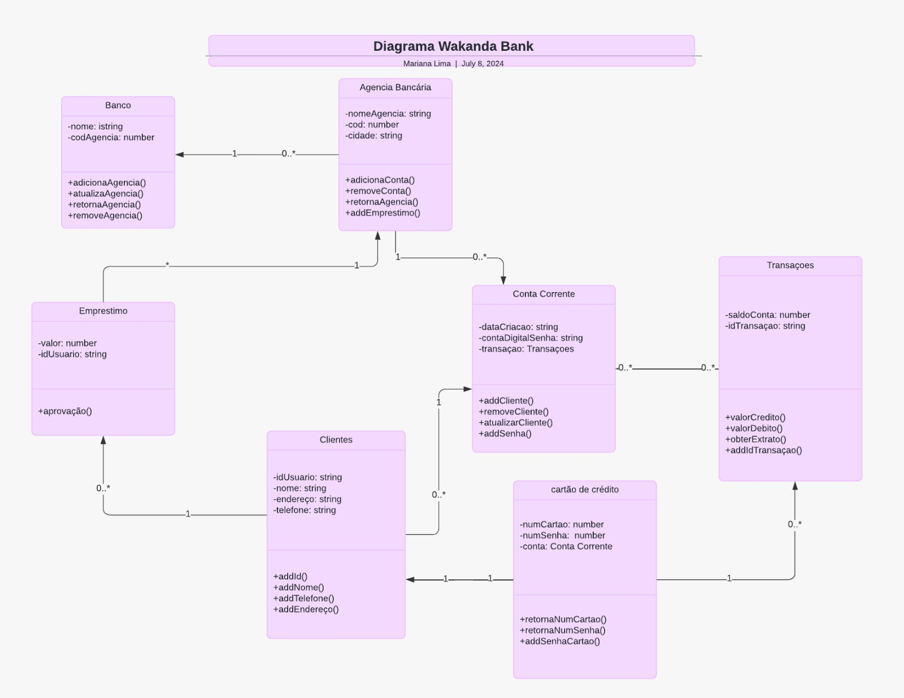
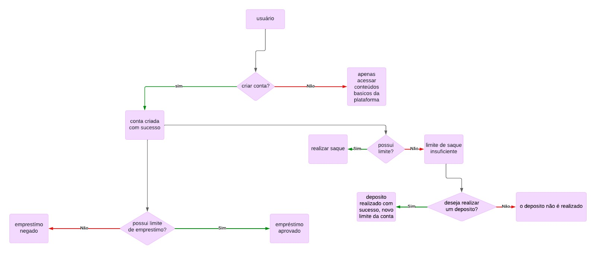

# ON36-IJS-WAKANDA-BANK

# Descrição do Projeto Wakanda Bank✊🏿
💡 Bancos comunitários são serviços financeiros solidários que visam gerar trabalho e renda, promovendo o desenvolvimento de economias locais, especialmente em territórios de baixa renda, por meio do apoio à economia popular e solidária.

O Wakanda Bank é um banco que visa ajudar pessoas que fazem parte de grupos "minoritários"  na sociedade. Quando digo essa palavra não me refiro a números e sim a pessoas que estão em posição desigual em algum sentido na sociedade.

 

## Serviços financeiros oferecidos pelo Wakanda Bank:

- Crédito para financiamento de empreendimentos solidários.
- Crédito para consumo pessoal e familiar, sem juros.
- Cartão de crédito popular solidário.
- Abertura e extrato de conta corrente.
- Depósito em conta corrente.
- Saque avulso ou com cartão magnético.
- Pagamento de contas (água, luz, telefone etc.).
- Recebimento de aposentadorias e outros - valores governamentais.
- Gerentes da conta.
- Prestação de contas diário e semanal para toda a comunidade.

---
## Programação Orientada a Objetos(OOP)
Pensando nos serviços oferecidos no banco decidi usar o paradigma orientado a objeto tendo em vista que minha aplicação terá muitas classes e instâncias de objetos e isso vai facilitar a compreensão e a manutenção do código, com isso terei um código mais modular e escalável.

## Diagrama de Classes
 

## Fluxo de abertura de conta

O usuário decide criar a conta
A conta é criada com sucesso e o cliente tem acesso a suas infos:
- O cliente verifica se possui saldo.
- O cliente pode solicitar empréstimo.
- O cliente realiza um depósito.

 
